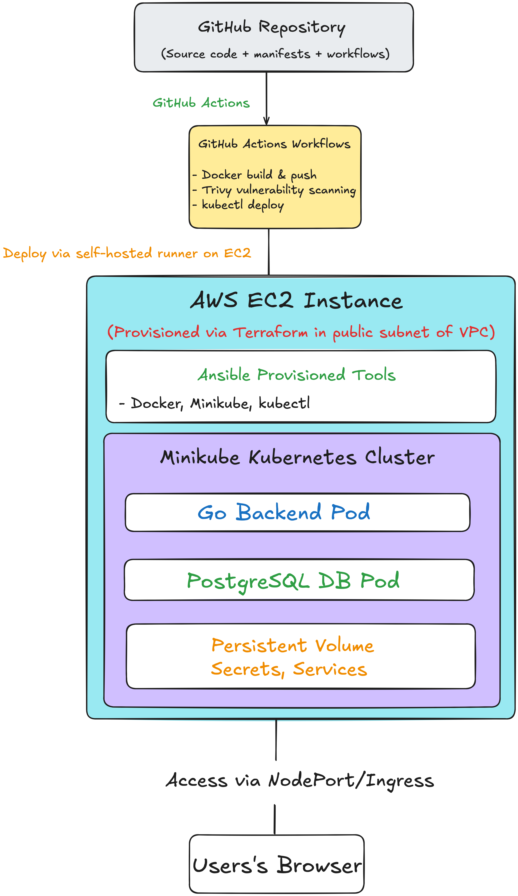
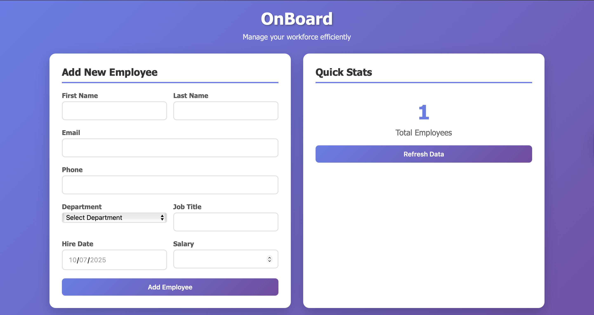

# OnBoard – Employee Management System with Terraform, K8s, Ansible & CI/CD 👥☸️📦

**OnBoard** is an Employee Management System that enables companies to add/delete employees and maintain a centralized employee directory. It’s built using Go for the backend, PostgreSQL for data persistence, and a static HTML/CSS/JS frontend. The project is containerized, Kubernetes-ready, Terraform-provisioned, Ansible-configured, and CI/CD enabled via GitHub Actions with a self-hosted runner on EC2.

---

## 📑 Table of Contents

- [Features](#features)
- [Tech Stack](#tech-stack)
- [Project Structure](#project-structure)
- [Architecture](#architecture)
- [Screenshots](#screenshots)
- [CI/CD Pipeline](#cicd-pipeline)
- [Local Setup (Docker)](#local-setup-docker)
- [Kubernetes Setup](#kubernetes-setup)
- [Infrastructure as Code](#Infrastructure-as-Code)
- [Ansible](#Ansible)
- [Secrets Management](#secrets-management)
- [Demo](#demo)
- [Author](#author)

---

## ✨ Features

- 🧑‍💼 Add, update, and delete employee records
- 📂 Central employee directory stored in PostgreSQL
- 📦 Dockerized with persistent volumes
- ☸️ Kubernetes-ready with manifest files and PVCs
- 🏗️ AWS Infrastructure provisioned via **Terraform**
- ⚙️ EC2 configured with **Ansible** (Docker, Minikube, kubectl)
- 🔁 GitHub Actions CI/CD with Docker build, scan, push, and deploy
- 🔒 Secure secrets handling using `.env` and Kubernetes Secrets

---

## 🧰 Tech Stack

| Layer         | Tool / Technology     |
|---------------|------------------------|
| Frontend      | HTML, CSS, JavaScript  |
| Backend       | Go                     |
| Database      | PostgreSQL             |
| Container     | Docker, Docker Compose |
| Deployment    | Kubernetes (Minikube)  |
| Infra as Code | Terraform, Ansible     |
| CI/CD         | GitHub Actions         |
| Security      | Kubernetes Secrets, `.env` |
| Volumes       | Docker & K8s PV/PVC    |

---

## 🗂️ Project Structure

```plaintext
OnBoard/
├── Ansible/                          # Ansible playbook for EC2 setup
│   └── playbook.yaml
├── aws-infra/                        # Terraform code for AWS VPC + EC2 infra
│   ├── ec2.tf
│   ├── internet_nat.tf
│   ├── output.tf
│   ├── providers.tf
│   ├── route_tables.tf
│   ├── security_groups.tf
│   ├── subnets.tf
│   └── vpc.tf
├── docs/                             # Architecture diagram + screenshots
├── .github/                          # GitHub Actions workflows
│   └── workflows/
│       └── cicd.yaml
├── Kubernetes/                       # Kubernetes manifests
│   ├── onboard-deployment.yaml
│   ├── onboard-service.yaml
│   ├── postgres-deployment.yaml
│   ├── postgres-pv.yaml
│   ├── postgres-pvc.yaml
│   ├── postgres-secret.yaml
│   └── postgres-service.yaml
├── onboard-data/                     # Local Docker volume directory
├── sql/                              # SQL schema
├── static/                           # Frontend static files
├── .env                              # Local secrets (gitignored)
├── .gitignore                        # Git ignore file
├── docker-compose.yaml               # Docker Compose for dev
├── Dockerfile                        # Dockerfile for backend
├── go.mod                            # Go module dependencies
├── main.go                           # Main Go backend logic
└── README.md

```

---

## 🏗️ Architecture



---

## 📸 Screenshots

  


---

## ⚙️ CI/CD Pipeline

- **GitHub Actions** pipeline:
  
  - 🐳 Build Docker image for backend
  - 🚢 Push to DockerHub: [`nsahil992/onboard`](https://hub.docker.com/r/nsahil992/onboard)
  - 🛡️ Scan for vulnerabilities with Trivy
  - ☸️ kubectl deploy to Minikube via self-hosted EC2 runner
 
---
## .env.example
```
DB_HOST=localhost/host.docker.internal/database
DB_PORT=5432 (your db port)
DB_USER=(your db user)
DB_PASSWORD=(your postgres password)
DB_NAME=(your database name)
```

## postgres-secret.example.yaml

```
apiVersion: v1
kind: Secret
metadata:
  name: postgres-secret
type: Opaque
data:
  POSTGRES_USER: anscGdssSE 
  POSTGRES_PASSWORD: c2hsgadafkgsdg== 
  POSTGRES_DB: Y3JvbfasbngnRlcg== 

  # echo -n "your value" | base64
```

---

## 💻 Local Setup (Docker)

```bash
# Clone the repo
git clone https://github.com/nsahil992/OnBoard
cd OnBoard

# Copy and configure .env
cp .env.example .env

# Start containers
docker compose up --build
```

---

## ☸️ Kubernetes Setup

```
# Apply Postgres manifests first
kubectl apply -f postgres-pvc.yaml -f postgres-secret.yaml -f postgres-service.yaml -f postgres-deployment.yaml -f postgres-pv.yaml -n onboard

# Apply OnBoard manifests
kubectl apply -f onboard-deployment.yaml -f onboard-service.yaml -n onboard

```

---

## 🏗️ Infrastructure as Code

Terraform (Provision EC2 + Networking)

```
cd aws-infra/
terraform init
terraform plan
terraform apply
```

Creates:

VPC with subnets
Internet Gateway + NAT
EC2 instance in public subnet

---

## Ansible (Provision EC2 Instance)

```
cd Ansible/
ansible-playbook -i inventory playbook.yaml
```

Installs:

- Docker
- Minikube
- kubectl

---

## 🔐 Secrets Management


✅ .env is used for local development only and is never committed to GitHub
✅ Kubernetes Secrets are defined in postgres-secret.yaml (base64-encoded)
🔒 You must create secrets locally 

---

## 📽️ Demo

[](https://youtu.be/abcd1234xyz)

> 🔗 Click the image above to watch a 5-minute walkthrough of OnBoard in action.

---

## 👤 Author

Built with 💻 and ☕️ by Sahil

- [GitHub](https://github.com/nsahil992)
- [LinkedIn](https://linkedin.com/in/nsahil992)

---

⭐ Don’t forget to star this repo if you loved this project!


